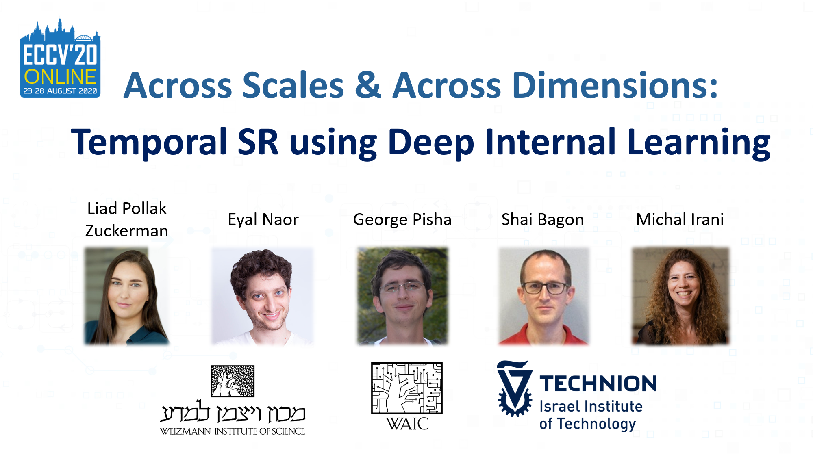
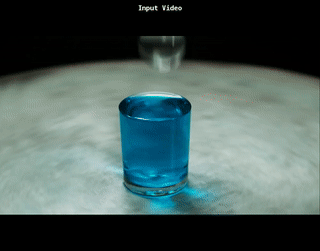
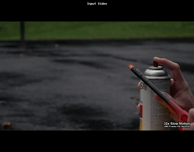
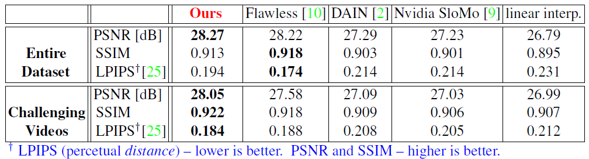

# [Across Scales & Across Dimensions](http://www.wisdom.weizmann.ac.il/~vision/DeepTemporalSR/)

### Please see the full [Project site](http://www.wisdom.weizmann.ac.il/~vision/DeepTemporalSR/) | [Paper (PDF)](http://www.wisdom.weizmann.ac.il/~vision/DeepTemporalSR/supplementary/AcrossScalesAndDimensions_ECCV2020.pdf)
**This is the official paper implementation of our ECCV paper**,
Across Scales & Across Dimensions:
Temporal Super-Resolution using Deep Internal Learning
  


  
  
  
  

  
  
  
  



## Getting Started

Clone the Repo:  
```bash
git clone https://github.com/eyalnaor/DeepTemporalSR.git
cd DeepTemporalSR
```

### Datasets

[Download Our Dataset](http://www.wisdom.weizmann.ac.il/~vision/DeepTemporalSR/supplementary/Dataset.html)  
The downloaded videos can be placed in ./Example_data or any other folder and change the "frames_folder" parameter in config.json or feed from the command line. 

### Prerequisites
Tested and ran on:   
 * Ubuntu - 18.04 LTS
 * CUDA - 10.1.243
 * CUDNN - 7.6.5
 * pytorch - 1.4.0
 * tensorboard - 2.1.0

for additional package information please refer to requirements.txt or env.yml  
**NOTE** - The environment was not tested on windows platforms, thus env.yml or venv might not work, if indeed they don't try installing manually. 
 
 
1. Setup conda 
    ```bash
    conda env create -f env.yml
    ```
    This will create a working environment named zstsr
2. Setup can also be performed with pip (virtual env) via the requirements.txt file 
    ```bash
    python -m venv zstsr
    
    source zstsr/bin/activate
    
    pip install -r requirements.txt
    ```
3. There are several examples provided with the code in ./Example_videos/\<vid\>/

## Running the Code
### Code
```bash
python main.py 
```
This will run the code with default configuration, as used to produce the results in the paper.  
This will output the HR results, along with saved models, etc. to the working_dir_base folder as specified in the config.

### Config
There are many tunable parameters. config.json sets the default values we used in our experiments.  

Below are the main configuration parameters to change:  
* **frames_folder** - Path to input (LR) frames  
* **working_dir_base** - Base Path to save results  
* **upsamaple_steps** - Upsampling scale for each iteration of the network  
* **backprojection** - Whether to use spatio-temporal Back-Projection  
* **fix_network** and **fine_tune** - If and how to retrain the network between upsampling iterations. See comments in config.json  
* **within/across/shift probability** - Probability of each augmentation in training  
* **num_epochs** - Number of training epochs  
  
For the full list of parameters please refer to the comments inside config.json


### External Flags
main.py also takes external flags, in order to override settings in the config.json, to enable multiple runs with different parameters.  
Useful flags:
* **--config** path to config. Default is config.json in the folder of main.py
* **--data** input data folder
* **--workingdir** result base folder
* **--initiallr** initial learning rate

For the full list of parameters please refer to the comments inside utils.create_parser()


### Numerical Evaluation
To see our full numerical evaluation on the dataset - [Numerical Results](http://www.wisdom.weizmann.ac.il/~vision/DeepTemporalSR/supplementary/Numerical_Results.html)  

## Numerical Results


## Visual Results
For all the videos and results please see [project site](http://www.wisdom.weizmann.ac.il/~vision/DeepTemporalSR/supplementary/Visual_Results.html)

## License

This project is licensed under the MIT License - see the [LICENSE.md](LICENSE.md) file for details

## References
[1] Jin, M., Hu, Z., Favaro, P.: Learning to extract flawless slow motion from blurry videos. In: The IEEE Conference on Computer Vision and Pattern Recognition (CVPR) (2019) 

[2] Bao, W., Lai, W.S., Ma, C., Zhang, X., Gao, Z., Yang, M.H.: Depth-aware video frame interpolation. In: Proceedings of the IEEE Conference on Computer Vision and Pattern Recognition (CVPR). pp. 3703–3712 (2019)

[3] Jiang, H., Sun, D., Jampani, V., Yang, M.H., Learned-Miller, E., Kautz, J.: Super slomo: High
quality estimation of multiple intermediate frames for video interpolation. In: Proceedings
of the IEEE Conference on Computer Vision and Pattern Recognition (CVPR) (2018)

[4] . Zhang, R., Isola, P., Efros, A.A., Shechtman, E., Wang, O.: The unreasonable effectiveness
of deep features as a perceptual metric. In: The IEEE Conference on Computer Vision and
Pattern Recognition (CVPR) (2018)

[5] Our imresize function was written by Ben Feinstein & Assaf Shocher Please see their work: [Assaf's Github](https://github.com/assafshocher/PyTorch-Resizer), [Ben's Github](https://github.com/feinsteinben)
